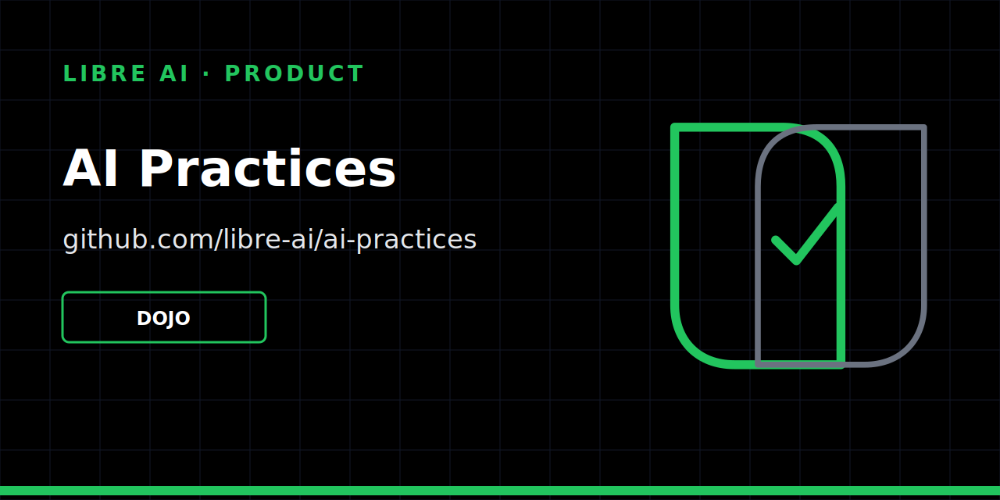

> [!WARNING]
> **Frozen on 2026-07-16 — reserved as the future home of AI Practices ([monorepo ADR-0008](https://github.com/libre-ai/libre-ai/blob/main/docs/adr/0008-multi-repo-target-topology-and-brand.md)).**
> AI Practices is being rebuilt from locked contracts in the canonical base repository [`libre-ai/libre-ai`](https://github.com/libre-ai/libre-ai) (target: `apps/practices`). This repository will reopen as the real product repository when the owner activates it. Everything below describes the pre-freeze state and no longer reflects the current architecture or roadmap.

<p align="center">
  
</p>

# Libre AI Practices

Professional training for sourced, responsible AI practice—**not a general-knowledge quiz and not HR scoring**.

## Status

| | |
| --- | --- |
| Maturity | **Dojo** — runnable Rust API/PWA and governed corpus |
| Works today | corpus validation/audit, fixture sessions, local API and PWA proof |
| Not scale-ready | shared session runtime, production operations and broad platform convergence |
| Historical IDs | `rumble-ai-practices-*` remain current crate identifiers |

## Principles

The product trains confidentiality, verification, sourcing, bias awareness, GDPR, security and professional responsibility. It rejects named rankings, disciplinary use, unsourced corrections and automatically published generated questions.

Every published question should carry an explanation, sources, risks and a review date. Generated media requires explicit provenance and human bias review.

## Quickstart

The service-free core and editorial gates run without secrets:

```bash
cargo test --workspace \
  --exclude rumble-ai-practices-api \
  --exclude rumble-ai-practices-store
cargo run -p rumble-ai-practices-cli -- validate-corpus --content content/questions
cargo run -p rumble-ai-practices-cli -- validate-activities --activities content/activities
cargo run -p rumble-ai-practices-cli -- audit-corpus \
  --content content/questions --media content/media --out reports/audit.json
cargo run -p rumble-ai-practices-cli -- run-session \
  --fixture fixtures/session-basic.json \
  --content content/questions --media content/media \
  --out reports/session-basic.json
cargo run -p rumble-ai-practices-cli -- serve --bind 127.0.0.1:3000
```

The complete workspace suite includes `#[sqlx::test]` cohort tests. The preferred local proof creates a private, short-lived PostgreSQL cluster reachable only through a temporary Unix socket, runs the 78 workspace tests, then stops and removes it:

```bash
./scripts/test-postgres-disposable.sh
```

It requires local PostgreSQL client/server binaries and uses no durable credential or existing database. For an externally managed disposable database, set `SQLX_OFFLINE=true` and provide a `DATABASE_URL` whose role may create test databases. Then open <http://127.0.0.1:3000>. Health and PWA proofs include `/readyz`, `/manifest.webmanifest` and `/sw.js`.

### Governed activity preview

Three reconstructed activities can be exercised locally without being mistaken for approved training content:

```bash
cargo run -p rumble-ai-practices-cli -- run-activity \
  --id activity-rag-citation-support \
  --status evidence-submitted \
  --evidence-ref evidence:synthetic-source-check \
  --allow-draft-preview \
  --out target/activity-outcome.json
```

Without `--allow-draft-preview`, the CLI refuses every non-approved activity. An evidence submission produces a reviewable outcome, never an automatic success or individual score.

## Database inspection gate

[`db-security-manifest.json`](db-security-manifest.json) records the anonymous cohort storage classifications from ADR 0006. Protected branches run the fail-closed workflow in [`.github/workflows/db-inspection.yml`](.github/workflows/db-inspection.yml) with the checksummed consolidated Proof Kit release `db-inspect-v0.1.0-alpha.7`. Run the same evidence check locally with no database connection or secret:

```bash
wrench-db-inspect run \
  --manifest db-security-manifest.json \
  --schema-dump crates/store/migrations/0001_anonymous_cohort.sql \
  --profile protected_branch \
  --report-json target/db-inspect/report.json
```

The current corpus passes with zero parser errors and zero unclassified tables. CI retains the redacted JSON and Markdown reports for 14 days; no global Bolt gate is enabled by this product workflow.

## Architecture

The Rust workspace separates domain rules, governed content, audit, session state, storage ports, API, CLI and UI. Dioxus/PWA is the current proof path; native targets remain conditional on evidence.

Key documentation:

- [Product vision](docs/vision.md)
- [Architecture](docs/architecture.md)
- [Content governance](docs/content-governance.md)
- [Security and GDPR](docs/security-rgpd.md)
- [Human review gate](docs/local-review.md)
- [Product readiness cockpit](docs/product-readiness.md)
- [Testing strategy](docs/testing-strategy.md)
- [Website curriculum reconstruction plan](docs/plans/2026-07-website-curriculum-reconstruction.md)

## Success criteria

An MVP requires a reviewed corpus, enforceable schemas, a complete private learning path and non-RH feedback. A runnable demo alone is not enough.

## Contributing

Read [`AGENTS.md`](AGENTS.md) and the governance documents before changing content, scoring or media.

## License

[MIT](LICENSE).
